<picture>
  <source media="(prefers-color-scheme: dark)" srcset="./assets/dark.svg" />
  <source media="(prefers-color-scheme: light)" srcset="./assets/light.svg" />
  
</picture>

<!-- ───────────────────────────────────────────────────────────────
     PHASE 2 (stats cards), PHASE 3 (contribution snake) and
     PHASE 4 (social badges) will be inserted below this line once
     they're built and verified. For now this README shows the
     animated banner only.
─────────────────────────────────────────────────────────────── -->

<!-- BANNER -->

  <picture>
    <source media="(prefers-color-scheme: dark)" srcset="./dark.svg">
    <source media="(prefers-color-scheme: light)" srcset="./light.svg">
    
  </picture>

<!-- SOCIAL BADGES -->

  
  &nbsp;&nbsp;
  
  &nbsp;&nbsp;
  
  &nbsp;&nbsp;
  

 

<!-- STATS -->

  

 

  
  

 

<!-- CONTRIBUTION SNAKE -->

  <picture>
    <source media="(prefers-color-scheme: dark)" srcset="https://raw.githubusercontent.com/Priyanshu6926/Priyanshu6926/output/github-contribution-grid-snake-dark.svg">
    <source media="(prefers-color-scheme: light)" srcset="https://raw.githubusercontent.com/Priyanshu6926/Priyanshu6926/output/github-contribution-grid-snake.svg">
    
  </picture>

